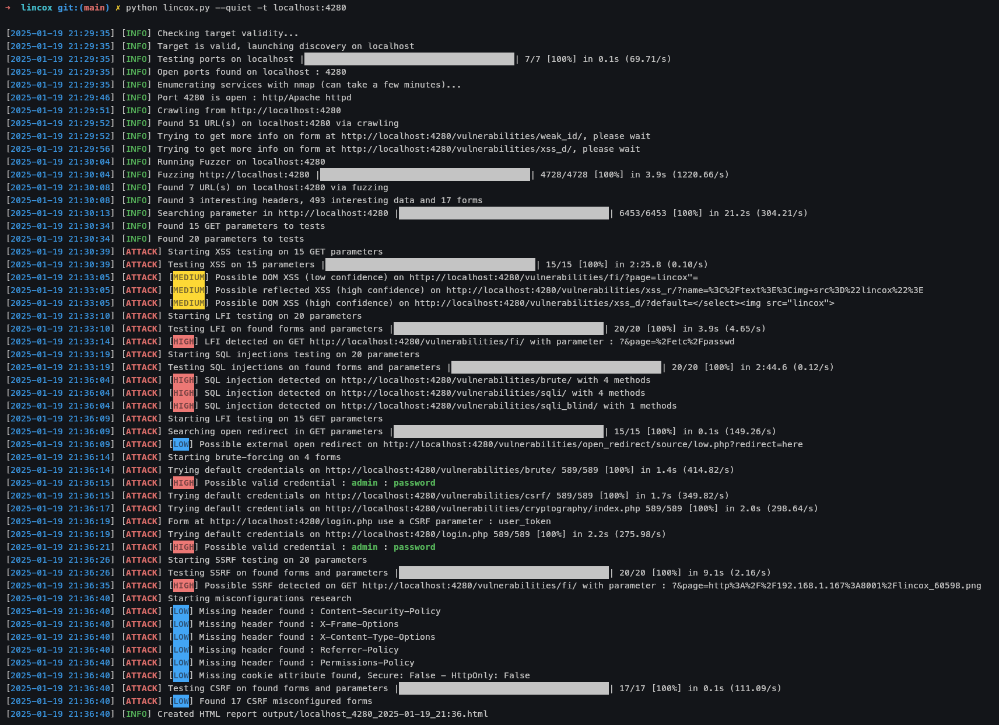

# LINCOX, the web application security scanner

## What is it ?

This tool is a simple vulnerability scanner for web applications.
It performs enumeration and automatic detection of forms and parameters for vulnerability testing

Attacks supported :
- XSS (reflected and DOM-based)
- Open-redirect
- SSRF
- LFI
- Default credentials bruteforcing
- SQL injection
- Common misconfigurations

## How to install 

The asiest way is to use a python virtual environment :
```shell
git clone https://github.com/Theophile-Wemaere/lincox.git
cd lincox
virtual env
source venv/bin/activate
pip install -r requirements.txt
```

Once this is done, you're good to go

## How to use it 

Help menu for lincox :
```
$ python3 lincox.py --help

usage: lincox.py [-h] [-t [TARGET]] [-m [MODE]] [-sc [SCOPE]] [--attacks [ATTACKS_FLAG]] [-p [PORTS]] [-f] [-sd] [-H HEADERS] [--skip-paraminer] [-g [USE_GUI]] [-oN [NORMAL_OUTPUT]] [-oC [CSV_OUTPUT]]
                 [-oJ [JSON_OUTPUT]] [-oA [ALL_OUTPUT]] [-d] [-q] [-l]

lincox, the python security scanner for web applications (and more)

options:
  -h, --help            show this help message and exit
  -t [TARGET], --target [TARGET]
                        Target to scan (IP or domain name)
  -m [MODE], --mode [MODE]
                        Scanner mode : 
                        enum : only conduct enumeration of services
                        full : default value, conduct enumeration and attack on target
  -sc [SCOPE], --scope [SCOPE]
                        Scope of the scanner : 
                        strict : only scan the given target, (no ports and subdomains enumeration)
                        medium : default value, scan target for differents services on most used ports
                        full : scan for subdomains and others services on found subdomains
  --attacks [ATTACKS_FLAG]
                        attacks to perform : 
                        X : XSS
                        L : LFI
                        S : SQL injection
                        O : open-redirect
                        B : brute-force
                        R : SSRF
                        M : misconfiguration (CSRF, headers)
                        Default to 'XLSOBRM' if this parameter is not used
  -p [PORTS], --ports [PORTS]
                        List of port to scan
                        Use CSV (80,8080,8443) or range (10-1000)
                        Default : 80,443,8000,8080,8081,8443
                         
  -f, --force           Force enumeration if target seems down (no pingback)
  -sd, --subdomains     Perform subdomain enumeration
  -H HEADERS, --headers HEADERS
                        Specify a header to be included. Can be used multiple times.
  --skip-paraminer      Skip parameter bruteforcing
  -g [USE_GUI], --gui [USE_GUI]
                        Can be used alone. Run GUI on given port, default to 5000
  -oN [NORMAL_OUTPUT]   Output script to given directory
  -oC [CSV_OUTPUT]      Output script in CSV (only found URL) to given directory
  -oJ [JSON_OUTPUT]     Output script in JSON to given directory
  -oA [ALL_OUTPUT]      Output script to normal,CSV and JSON in given directory
  -d, -v, --verbose, --debug
                        Debug/Verbose mode
  -q, --quiet           Hide banner
  -l                    load pickle target
```

Different parameters :
- `-t`/`--target` : IP address, URL or domain name of the target you want to scan
- `-m`/`--mode` : scanner mode to use
    - enum : only perform enumeration phase and exit
    - full : default, perform both enumeration and attack phase
- `-sc`/`--scope` : scope of the scan
    - strict : only scan the given target, only scan given protocol or port if given
    - medium : default, scan targets on most commons web services ports
    - full : like medium but also perform subdomain enumeration
- `--attacks` : flag system to select which attack to performn default to all
    - Flag can be used invidually or by group
    - E.G : `--attacks X` for only XSS, `--attacks LX` for LFI and XSS
    - X : XSS
    - L : LFI
    - S : SQL injection
    - O : open-redirect
    - B : brute-force
    - R : SSRF
    - M : misconfiguration (CSRF, headers)
- `-p`/`--ports` : override default port list to scan
    - like nmap, accept list and range
- `-f`/`-force` : Force scan even if target seems to be down
- `-g`/`--gui` : Use web interface on port 5000.
    - Can also specify another port to use
    - `--gui 8000` for example
- `-oN`/`-oC`/`-oJ` : output results as normal, CSV or JSON to the given directory
- `-oA` : use all format to output to the given directory
- `-d`/`--debug`/`-v`/`--verbose` : Show more informations for debug purpose (very verbose)
- `-q`/`--quiet` : hide the banner
- `-l` : debug, load target.pkl if found will skip enumeration

## Example of output for a scan on [DVWA](https://github.com/digininja/DVWA) :


